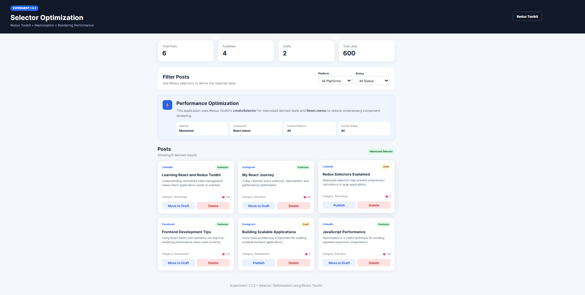
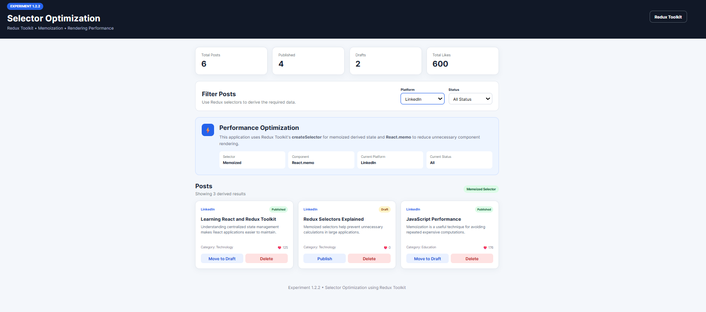
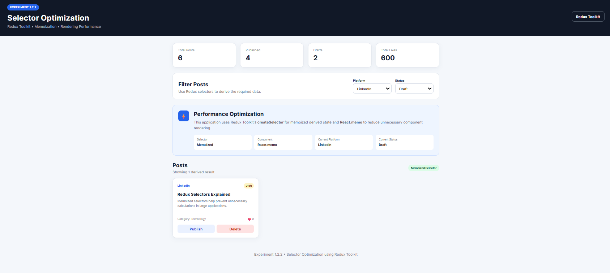

# Experiment 1.2.2 – Selector Optimization

## Aim

To optimize Redux state access and improve React application performance using memoized selectors and efficient component rendering techniques.

## Objectives

* To understand the concept of derived state.

* To implement memoized selectors using `createSelector()`.

* To reduce unnecessary component re-renders.

* To improve application performance.

* To efficiently access and manage Redux state.

* To understand how memoization improves application performance.

## Software Requirements

* Node.js

* npm

* React.js

* Redux Toolkit

* React-Redux

* Visual Studio Code

* Google Chrome

## Technologies Used

* React.js

* JavaScript

* HTML5

* CSS3

* Redux Toolkit

* React-Redux

* Vite

## Description

This project demonstrates optimized state management and component rendering in a React application using Redux Toolkit.

The application manages a collection of posts and provides filtering based on different criteria such as platform and status.

Redux Toolkit is used to maintain application state in a centralized Redux store. Memoized selectors are implemented using `createSelector()` to efficiently derive filtered and statistical data from the Redux state.

Instead of storing derived data directly in the Redux store, the application calculates it dynamically using selectors. Memoization ensures that expensive calculations are performed only when the input state changes.

The application also demonstrates component rendering optimization using `React.memo` and efficient state access using `useSelector()`.

## Features

* Centralized Redux state management.

* Derived state calculation.

* Memoized selectors using `createSelector()`.

* Multi-criteria post filtering.

* Platform-based filtering.

* Status-based filtering.

* Dynamic post statistics.

* Efficient Redux state access.

* Reduced redundant computations.

* Reduced unnecessary component re-renders.

* Component optimization using `React.memo`.

* Calculation optimization using `useMemo`.

* Performance monitoring.

* Selector recomputation tracking.

* Responsive user interface.

## Selector Architecture

The application uses separate selectors to extract and derive required data from the Redux store.

```text
Redux Store

│
└── posts
    │
    ├── items
    │
    ├── filters
    │   ├── platform
    │   └── status
    │
    └── status

        │
        ▼

   Memoized Selectors
        │
        ├── selectAllPosts
        ├── selectFilteredPosts
        ├── selectPostStats
        └── selectFilteredPostCount

        │
        ▼

    React Components


Redux Toolkit Implementation
Store

The Redux store is configured using configureStore().

export const store = configureStore({
  reducer: {
    posts: postsReducer,
  },
});
Posts Slice

The posts slice manages post-related state and provides:

Post data management.
Platform filtering.
Status filtering.
Filter state management.
Post statistics.
Redux state updates.
Derived State

Derived state represents data that can be calculated from existing Redux state.

For example, instead of storing filtered posts separately:

{
  posts: [...],
  filteredPosts: [...]
}

the application calculates filtered posts using a selector.

This avoids duplicate data and prevents inconsistencies between the original and derived data.

Example:

const selectFilteredPosts = createSelector(
  [selectAllPosts, selectPlatform, selectStatus],
  (posts, platform, status) => {
    return posts.filter((post) => {
      const platformMatch =
        platform === "All" || post.platform === platform;

      const statusMatch =
        status === "All" || post.status === status;

      return platformMatch && statusMatch;
    });
  }
);
Memoized Selectors

Memoized selectors are implemented using Redux Toolkit's createSelector().

A memoized selector remembers the previous input values and calculated result.

If the input values have not changed, the selector returns the previously calculated result instead of performing the calculation again.

The basic flow is:

Selector Called

      ↓

Check Input References

      ↓

Inputs Unchanged?
   │
   ├── YES → Return Cached Result
   │
   └── NO → Recalculate Result
                ↓
           Cache New Result

This reduces unnecessary computations and improves application performance.

Selector Optimization

The application uses selectors to efficiently access Redux state.

Basic Selector

A basic selector extracts data from the Redux store.

const selectAllPosts = (state) =>
  state.posts.items;
Memoized Selector

A memoized selector calculates derived data only when its inputs change.

const selectFilteredPosts = createSelector(
  [selectAllPosts, selectPlatform, selectStatus],
  (posts, platform, status) => {
    return posts.filter((post) => {
      const platformMatch =
        platform === "All" ||
        post.platform === platform;

      const statusMatch =
        status === "All" ||
        post.status === status;

      return platformMatch && statusMatch;
    });
  }
);
React Rendering Optimization

The application uses React optimization techniques to minimize unnecessary rendering.

React.memo()

React.memo() prevents a component from re-rendering when its props have not changed.

Example:

export default React.memo(PostCard);

This is particularly useful for lists containing multiple post components.

If one part of the application changes, unchanged post cards can avoid unnecessary re-renders.

useMemo()

useMemo() is used to cache the result of expensive calculations inside a component.

const statistics = useMemo(() => {
  return calculateStatistics(posts);
}, [posts]);

The calculation is performed again only when the posts dependency changes.

React Redux Hooks
useSelector()

useSelector() is used to access Redux state and selector results.

const posts = useSelector(selectFilteredPosts);

Using a memoized selector allows the component to receive a stable result when its input values have not changed.

useDispatch()

useDispatch() is used to dispatch Redux actions.

const dispatch = useDispatch();

dispatch(setPlatform("Instagram"));
Filtering Workflow

The application supports filtering posts using multiple criteria.

The filtering process is:

User Selects Filter

        ↓

dispatch(action)

        ↓

Redux Store Updated

        ↓

Memoized Selector

        ↓

Check Selector Inputs

        ↓
 ┌───────────────┐
 │ Inputs Changed?│
 └───────────────┘
      │       │
     YES      NO
      │       │
      ▼       ▼
 Recalculate  Cached Result
      │       │
      └───┬───┘
          ↓
     useSelector()
          ↓
    React Component
          ↓
       UI Updated
Performance Optimization

The application demonstrates how memoization improves performance.

Without memoization:

Component Render
      ↓
Selector Calculation
      ↓
Filter All Posts
      ↓
Create New Array
      ↓
Potential Re-render

With memoization:

Component Render
      ↓
Memoized Selector
      ↓
Inputs Unchanged?
      ↓
Return Cached Array
      ↓
Avoid Unnecessary Calculation

This becomes particularly useful when the application contains a large number of posts or complex derived calculations.

Performance Monitoring

The application includes a performance panel to demonstrate selector and component optimization.

The panel can be used to observe:

Selector recomputations.
Component render counts.
Memoization status.
Filter performance.
Rendering optimization.

The performance information helps verify that selectors are being recalculated only when required.

Project Structure
Experiment-1.2.2-Selector-Optimization/

│
├── src/
│   │
│   ├── app/
│   │   └── store.js
│   │
│   ├── components/
│   │   ├── Header.jsx
│   │   ├── Stats.jsx
│   │   ├── FilterBar.jsx
│   │   ├── PostCard.jsx
│   │   ├── PostList.jsx
│   │   └── PerformancePanel.jsx
│   │
│   ├── features/
│   │   └── posts/
│   │       ├── postsSlice.js
│   │       └── postsSelectors.js
│   │
│   ├── App.jsx
│   ├── main.jsx
│   └── index.css
│
├── screenshots/
│   ├── home.png
│   ├── filtered-posts.png
│   └── performance.png
│
├── index.html
├── package.json
├── vite.config.js
└── README.md
## Screenshots

### Home

Initial application dashboard displaying post statistics, filter controls, performance information, and the post listing.



### Filtered Posts

Application view showing posts filtered using multiple criteria such as platform and status.



### Performance Panel

Performance panel showing selector memoization, recomputation information, and rendering optimization.



Expected Outcome
Memoized selectors successfully implemented using createSelector().
Derived state calculated efficiently without storing duplicate data.
Redux state accessed efficiently using selectors.

Learning Outcomes
Learned how to identify and manage derived state.
Understood the working principle of memoized selectors.
Learned to implement createSelector() for efficient state derivation.
Understood how selector reference equality affects React rendering.

Conclusion
In this experiment, Redux Toolkit state access and React component rendering were optimized using memoized selectors, React.memo(), and useMemo().

Derived state was calculated dynamically instead of being stored as duplicate data in the Redux store. The use of createSelector() reduced unnecessary recalculations by caching selector results when input values remained unchanged.