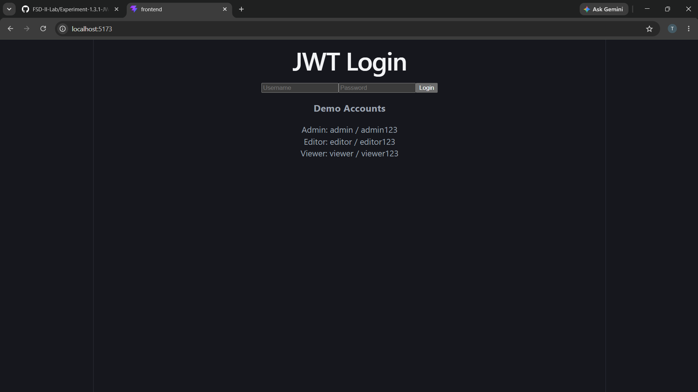
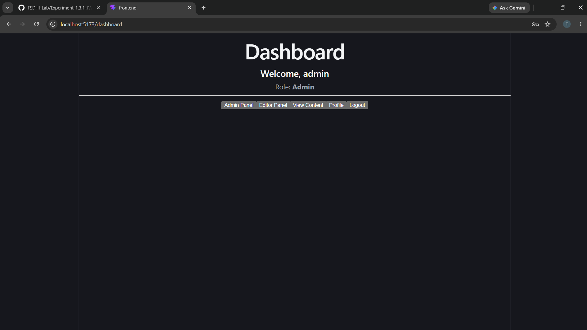
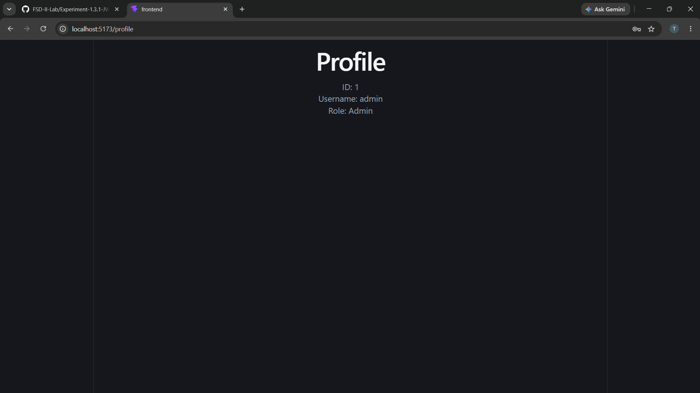
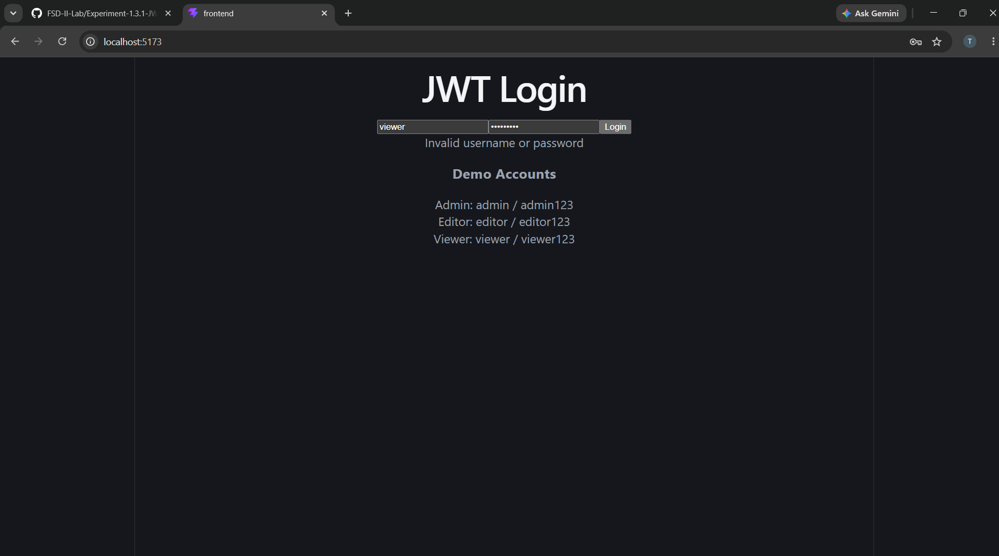
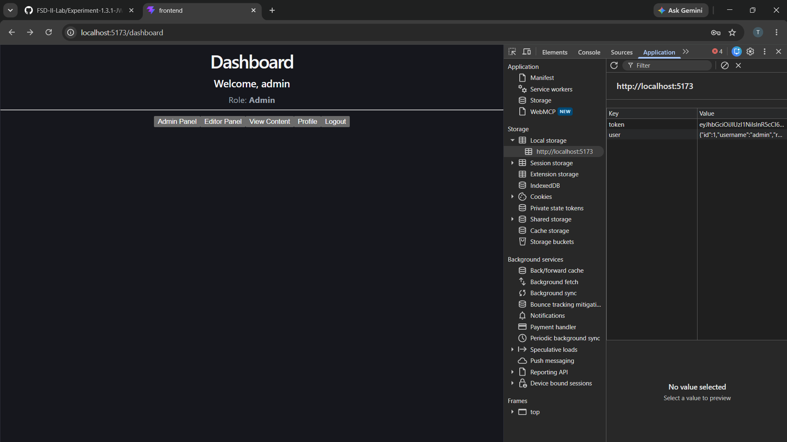

# Experiment 1.3.1 -- JWT Authentication

## Aim

To design and implement a secure authentication system using JWT for
user login and session management.

## Objectives

-   Understand authentication mechanisms in web applications.
-   Implement token-based authentication using JWT.
-   Generate and validate JWT tokens.
-   Implement stateless session management.
-   Store and use the authentication token for protected requests.
-   Protect application routes using authentication.

## Software Requirements

-   Node.js
-   React.js
-   Vite
-   Express.js
-   JSON Web Token
-   bcryptjs
-   React Router DOM
-   Visual Studio Code
-   Google Chrome

## Technologies Used

-   React.js
-   JavaScript
-   HTML
-   CSS
-   Node.js
-   Express.js
-   JWT
-   Local Storage

## Features

-   JWT-based user login
-   Username and password validation
-   JWT token generation
-   Token storage in Local Storage
-   Protected routes
-   Authentication middleware
-   User profile
-   Dashboard
-   Logout functionality
-   Stateless authentication

## Authentication Flow

``` text
User Login
    ↓
Enter Username & Password
    ↓
Send Credentials to Server
    ↓
Validate Credentials
    ↓
Generate JWT
    ↓
Return JWT to Frontend
    ↓
Store Token in Local Storage
    ↓
Send Token with Protected Requests
    ↓
Verify JWT
    ↓
Allow / Deny Access
```

## Demo Accounts

  Role     Username   Password
  -------- ---------- -------------
  Admin    `admin`    `admin123`
  Editor   `editor`   `editor123`
  Viewer   `viewer`   `viewer123`

## Project Structure

``` text
Experiment-1.3.1-JWT-Authentication/
│
├── backend/
│   ├── server.js
│   └── .env
│
├── frontend/
│   ├── src/
│   │   ├── components/
│   │   │   └── ProtectedRoute.jsx
│   │   ├── pages/
│   │   │   ├── Login.jsx
│   │   │   ├── Dashboard.jsx
│   │   │   └── Profile.jsx
│   │   ├── App.jsx
│   │   ├── index.css
│   │   └── main.jsx
│   ├── package.json
│   └── vite.config.js
│
└── README.md
```

> **Note:** `.env` contains the JWT secret and should not be uploaded to
> GitHub.

## Procedure

### 1. Create React Frontend

``` bash
npm create vite@latest frontend -- --template react
cd frontend
npm install
npm install react-router-dom
```

### 2. Create Node.js Backend

``` bash
mkdir backend
cd backend
npm init -y
npm install express cors jsonwebtoken bcryptjs dotenv
```

### 3. Configure Environment Variables

Create `.env` inside the backend:

``` env
JWT_SECRET=my_super_secret_key_123
PORT=5000
```

### 4. Start Backend

``` bash
node server.js
```

Expected output:

``` text
Server running on http://localhost:5000
```

### 5. Start Frontend

Open another terminal:

``` bash
cd frontend
npm run dev
```

Expected output:

``` text
Local: http://localhost:5173/
```

## API Endpoints

  Method   Endpoint           Purpose
  -------- ------------------ ------------------------------------
  POST     `/api/login`       Authenticate user and generate JWT
  GET      `/api/profile`     Access authenticated user profile
  GET      `/api/dashboard`   Access protected dashboard

## JWT Structure

A JWT consists of three parts:

``` text
Header.Payload.Signature
```

### Header

Contains the token type and signing algorithm.

### Payload

Contains user information such as username and role.

### Signature

Verifies the authenticity and integrity of the token.

## Testing

### Login Test

Enter valid credentials:

``` text
Username: admin
Password: admin123
```

Expected result:

``` text
Login Successful
Dashboard displayed
```

### Invalid Login Test

Enter an incorrect username or password.

Expected result:

``` text
Authentication Failed
```

### Protected Route Test

Try opening a protected page without logging in.

Expected result:

``` text
Redirected to Login / Unauthorized Access
```

## Screenshots

### Home / JWT Login

The application displays the JWT login page with username and password
fields and demo accounts.



### Successful Login

After entering valid credentials, the authenticated user is redirected
to the protected dashboard.



### User Profile

The authenticated user's profile information is displayed.



### Protected Route

Unauthenticated users are prevented from accessing protected pages.



### JWT in Local Storage

The generated JWT can be verified through Browser Developer Tools →
Application → Local Storage.



## Expected Output

-   User can log in using valid credentials.
-   JWT is generated after successful authentication.
-   JWT is stored on the client side.
-   Protected routes require authentication.
-   Invalid users cannot access protected resources.
-   Authenticated user information can be displayed.

## Result

The JWT-based authentication system was successfully implemented using
React.js, Node.js, Express.js, and JSON Web Token.

## Conclusion

The experiment demonstrates how JWT can be used for secure, stateless
authentication in a web application. Users are authenticated through
their credentials, a JWT is generated after successful login, and
protected resources are accessed only after successful token validation.
