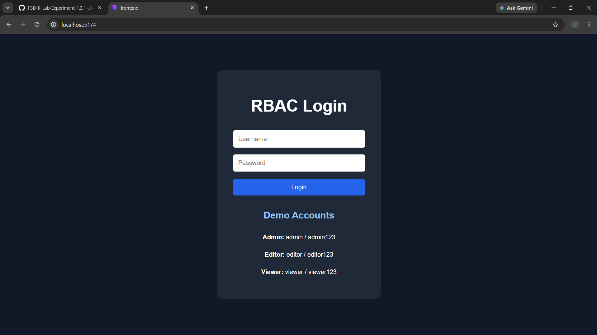
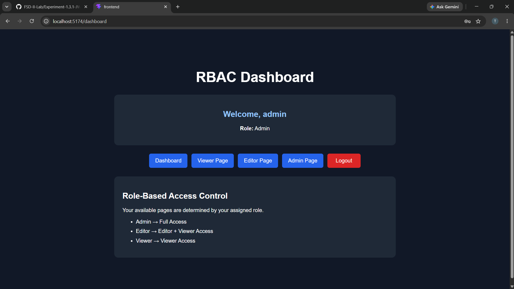
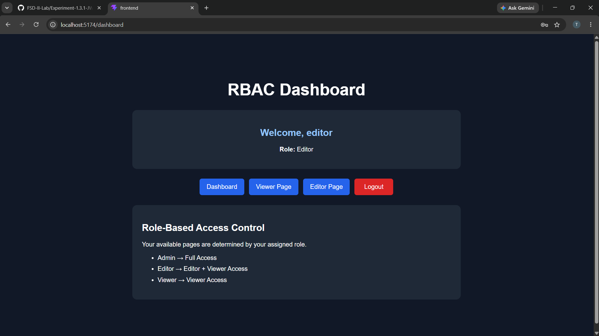
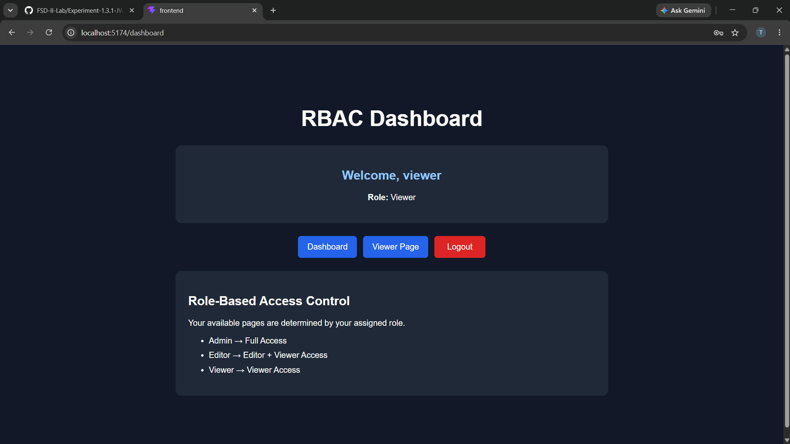
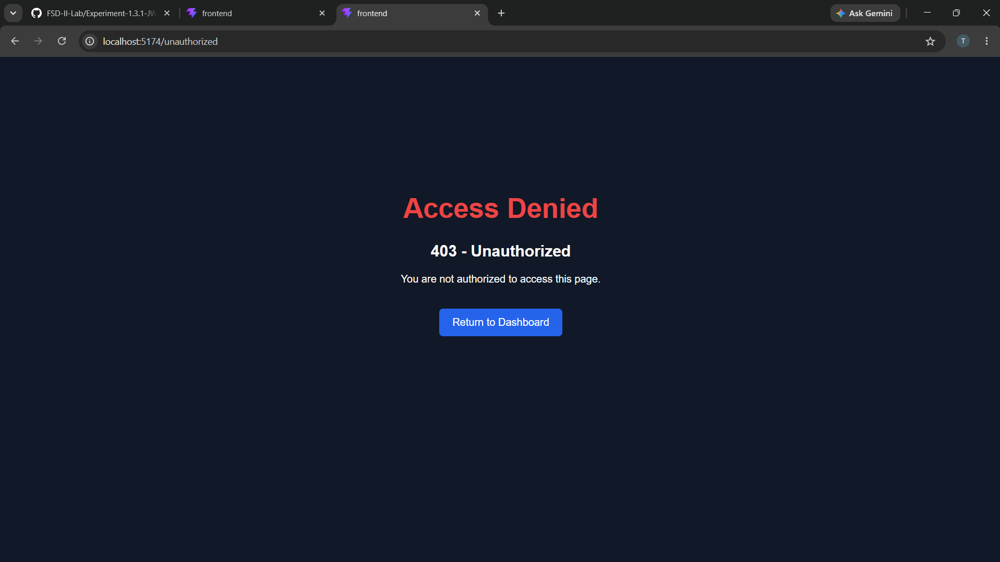
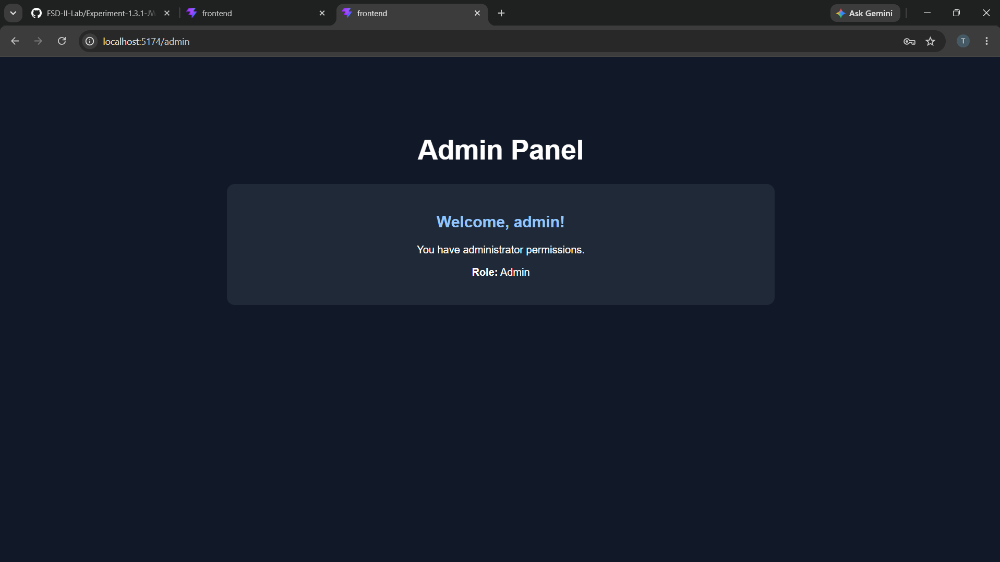

# Experiment 1.3.2 – Role-Based Access Control (RBAC)

---

## Aim

To implement Role-Based Access Control (RBAC) and secure application routes based on user roles and permissions.

---

## Objectives

- To understand authentication and authorization.
- To implement Role-Based Access Control (RBAC).
- To create protected application routes.
- To restrict pages according to user roles.
- To display role-specific content dynamically.
- To redirect unauthorized users from restricted routes.

---

## Software Requirements

- Node.js
- React.js
- React Router DOM
- Visual Studio Code
- Web Browser
- Git & GitHub

---

## Technologies Used

- React.js
- JavaScript
- HTML5
- CSS3
- React Router DOM
- JWT Authentication
- Role-Based Access Control

---

## Roles Implemented

| Role | Permissions |
|---|---|
| Admin | Dashboard, Profile, Viewer, Editor and Admin pages |
| Editor | Dashboard, Profile, Viewer and Editor pages |
| Viewer | Dashboard, Profile and Viewer pages |

---

## Features

- Role-based authentication
- Protected routes
- Admin access control
- Editor access control
- Viewer access control
- Unauthorized access handling
- Role-specific navigation
- Dynamic UI based on user role

---

# Screenshots

## 1. Login Page

The login page allows users to enter their username and password.

---

## 2. Admin Dashboard

After successful login with the Admin account, the user can access the dashboard and all authorized pages.

---

## 3. Editor Dashboard

The Editor role can access the pages permitted for Editors but cannot access Admin-only pages.

---

## 4. Viewer Dashboard

The Viewer role has limited access to the application.

---

## 5. Unauthorized Access

When a user tries to access a page that is not permitted for their role, the application displays an unauthorized access message.

---

## 6. Role-Based Navigation

The navigation menu changes according to the logged-in user's role.

---

## Result

The Role-Based Access Control system was successfully implemented. Users can access application routes according to their assigned roles, while unauthorized users are prevented from accessing restricted pages.