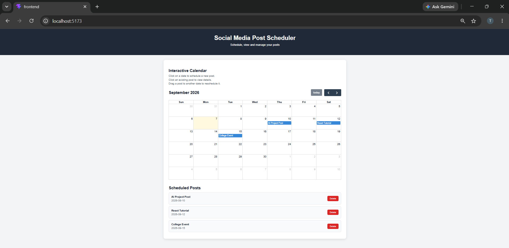
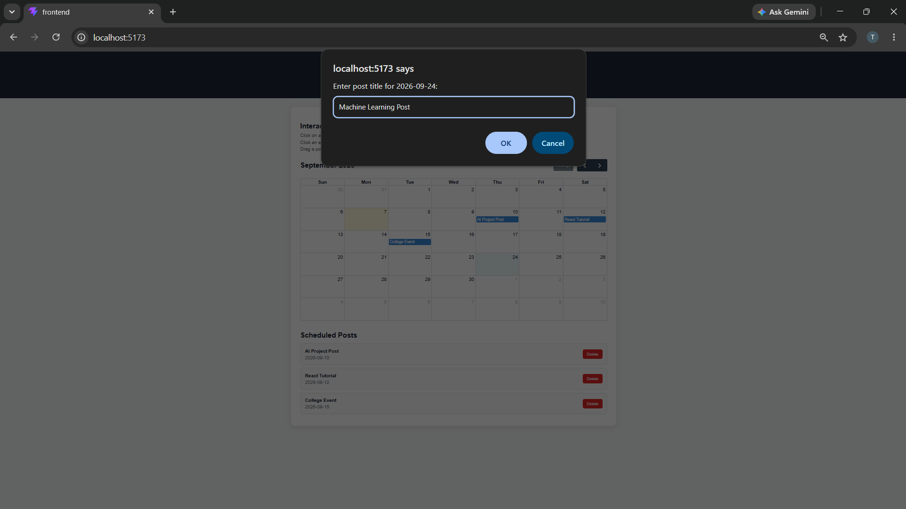
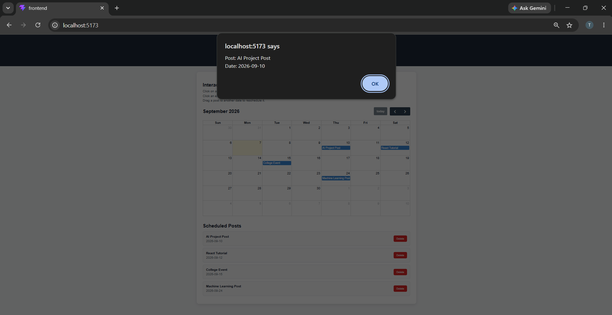
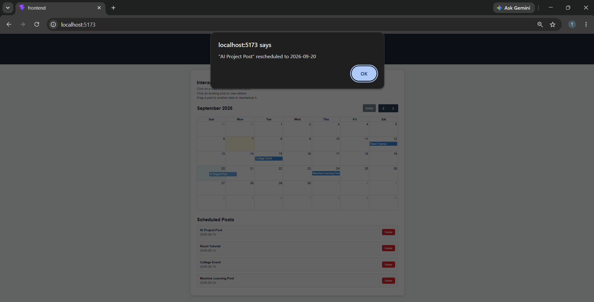

# Experiment 1.4.1 – Interactive Calendar Interface

## Aim

To design and implement an interactive calendar interface for scheduling and managing posts.

---

## Objectives

- Understand time-based data visualization.

- Implement calendar-based scheduling interfaces.

- Map structured data to temporal layouts.

- Enable user interactions such as click and drag-and-drop.

---

## Software Requirements

- React.js

- Node.js

- npm

- FullCalendar

- Visual Studio Code

- Google Chrome

---

## Technologies Used

- React.js

- JavaScript

- HTML5

- CSS3

- FullCalendar

- Vite

---

## Features

- Interactive monthly calendar

- Schedule new posts

- Display scheduled posts

- View post details

- Drag-and-drop rescheduling

- Delete scheduled posts

- Dynamic event rendering

- Responsive UI

---

## Screenshots

### Interactive Calendar

---

### Add New Post

---

### Event Details

---

### Drag and Drop

---

## Expected Outcome

- Working interactive calendar interface

- Posts mapped to specific dates

- Dynamic scheduling and rescheduling

- User interaction through click and drag-and-drop

- Improved content planning experience

---

## Conclusion

Successfully designed and implemented an interactive calendar interface using React.js and FullCalendar for scheduling, managing, and rescheduling posts with dynamic user interactions.