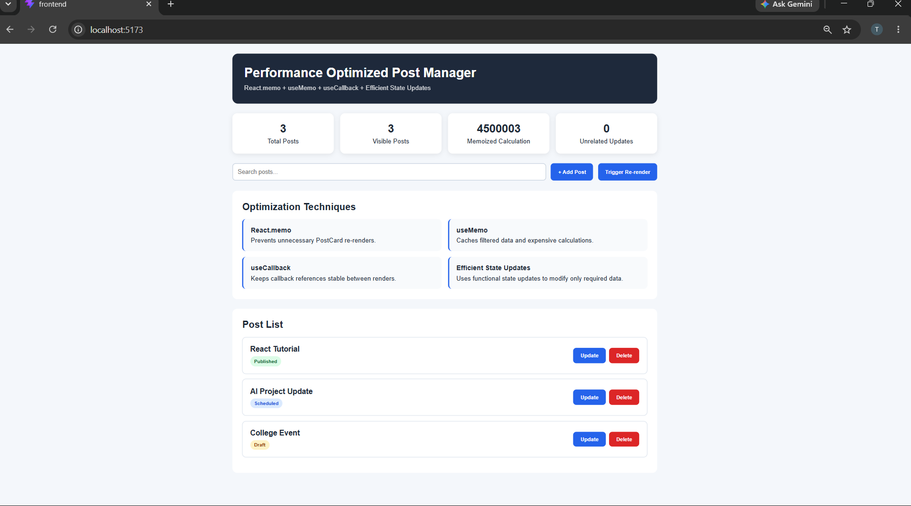
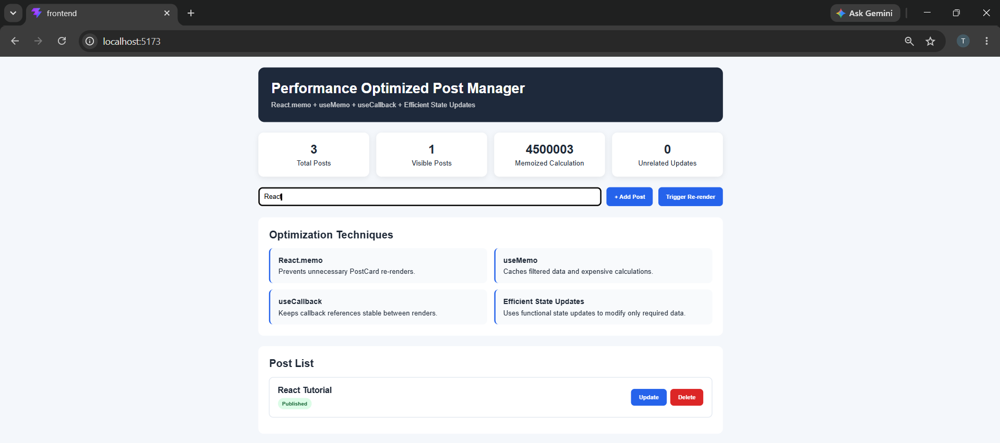
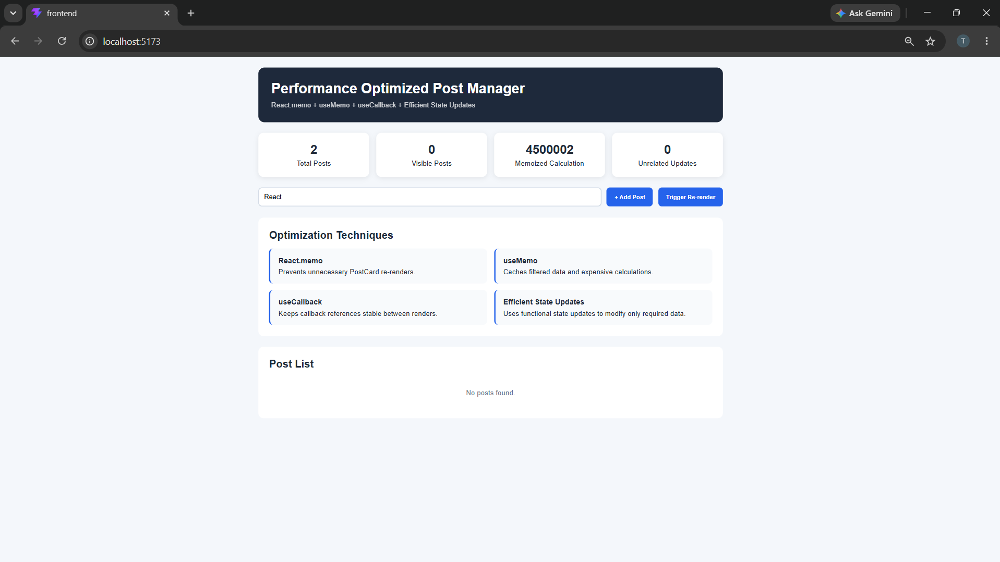
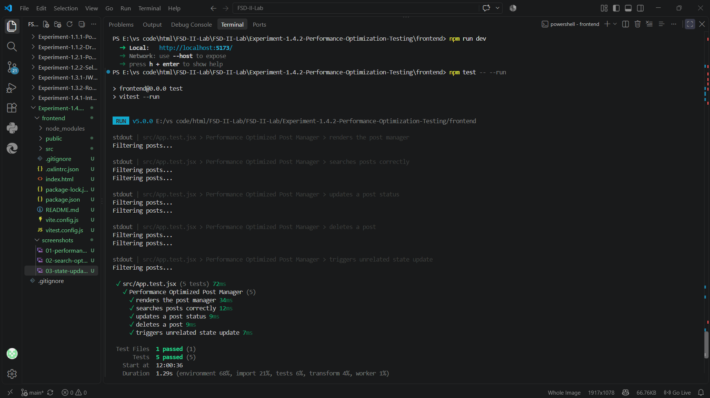

# Experiment 1.4.2 – Performance Optimization and Testing

## Aim

To optimize rendering performance and implement testing strategies for interactive UI components.

---

## Objectives

- Understand performance bottlenecks in UI systems.
- Optimize rendering using memoization techniques.
- Reduce unnecessary re-renders.
- Implement testing for UI components and logic.
- Test user interactions such as search, update, delete, and re-render.

---

## Software Requirements

- React.js
- Node.js
- npm
- Vitest
- React Testing Library
- Browser DevTools
- Visual Studio Code
- Google Chrome

---

## Technologies Used

- React.js
- JavaScript
- HTML5
- CSS3
- Vite
- React.memo
- useMemo
- useCallback
- Vitest
- React Testing Library

---

## Features

- Performance optimized React components
- Memoized components using React.memo
- Expensive calculations optimized using useMemo
- Stable callback references using useCallback
- Efficient state updates
- Search functionality
- Add new posts
- Update post status
- Delete posts
- Automated component testing
- User interaction testing
- Responsive UI

---

## Performance Optimization Techniques

### React.memo

Prevents unnecessary re-rendering of components when their props have not changed.

### useMemo

Caches expensive calculations and recalculates them only when their dependencies change.

### useCallback

Maintains stable function references between renders and helps prevent unnecessary child component re-renders.

### Efficient State Updates

Functional state updates are used to update the latest state safely and efficiently.

---

## Testing

The application was tested using Vitest and React Testing Library.

The following test cases were implemented:

- Render Post Manager
- Search Posts
- Update Post Status
- Delete Post
- Trigger Re-render

All **5 test cases passed successfully**.

---

## Screenshots

### Performance Dashboard

---

### Search Optimization

---

### State Update

---

### Testing Results

---

## Expected Outcome

- Optimized calendar/post rendering.
- Reduced unnecessary component re-renders.
- Efficient state management.
- Stable and reusable UI components.
- Successfully tested user interactions.
- Improved application performance and reliability.

---

## Conclusion

Successfully implemented performance optimization and testing strategies in a React application using React.memo, useMemo, useCallback, efficient state updates, Vitest, and React Testing Library. The application provides optimized rendering and successfully passes all implemented test cases.